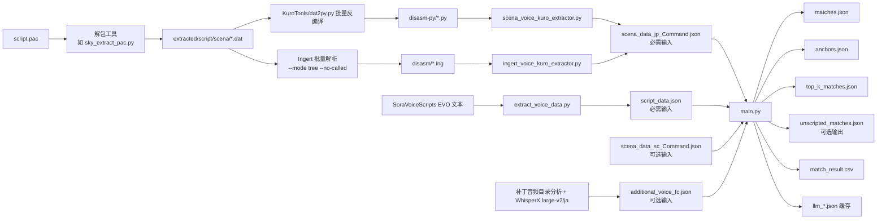
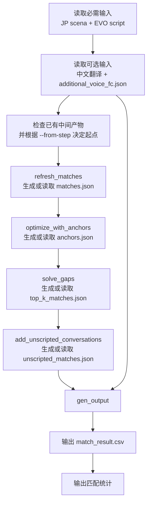

# Trails In The Sky Script Aligner

## 项目概述

将**空之轨迹 1st / 2nd（Remake）**的台词与对应的**空之轨迹 FC / SC 进化版（EVO）**的台词自动对齐，生成一一对应的 CSV 匹配表，方便后续人工校对、音频绑定等用途。

最近为了更好地应用大模型能力，对原来的 [sora-scena-matcher](https://github.com/lxr2010/sora-scena-matcher) 进行了重构。脚本已支持 1st 与 2nd，设计上也可迁移到 3rd，甚至零/碧轨脚本比对场景。

核心流程：从 Remake 反编译结果中提取台词 → 从 EVO 文本中提取台词 → 多阶段匹配输出 CSV。

> **Overview**
>
> Automatically align dialogue lines between **Trails in the Sky the 1st / 2nd (Remake)** and their corresponding **FC / SC Evolution (EVO)** counterparts, producing a one-to-one CSV match table for downstream manual review and voice binding.
>
> This is a refactor of [sora-scena-matcher](https://github.com/lxr2010/sora-scena-matcher), rebuilt to better leverage LLM capabilities. The 1st and 2nd are supported; the same architecture is portable to 3rd and potentially Zero/Ao.
>
> Core pipeline: extract lines from Remake decompilation output → extract lines from EVO text → multi-stage alignment → CSV.

---

## 前置条件

开始前，你需要准备好以下内容：

| 你需要的东西 | 说明 |
|---|---|
| **空之轨迹 1st 游戏文件**（Steam/GOG） | 需要 `script.pac` 用于提取 Remake 台词 |
| **空之轨迹 FC Evolution 游戏文件** 或 SoraVoiceScripts 补丁 | 需要 EVO 文本和语音数据 |
| **Python 3.13+** | `uv` 会自动管理，无需手动安装 |
| **OpenAI 兼容 API Key** | 用于 LLM 辅助匹配。推荐 [DeepSeek](https://platform.deepseek.com/)（注册即送免费额度），也可用 OpenAI 官方或其它兼容网关 |
| **KuroTools** 或 **Ingert**（二选一） | 用于反编译 scena 脚本。见下方工具获取说明 |
| （可选）**WhisperX** | 如需处理脚本外语音转录 |

### 工具获取

- **KuroTools**：`git clone https://github.com/nnguyen259/KuroTools.git` 到项目目录下
- **Ingert**：从 https://github.com/Aureole-Suite/Ingert 下载预编译 `ingert.exe` 或自行编译
- **kuro_dlc_tool**（解包 script.pac）：https://github.com/eArmada8/kuro_dlc_tool

> **Prerequisites**
>
> | What you need | Notes |
> |---|---|
> | **Trails in the Sky the 1st** game files (Steam/GOG) | `script.pac` is needed for Remake text extraction |
> | **Trails in the Sky FC Evolution** game files, or the SoraVoiceScripts patch | EVO text and voice data required |
> | **Python 3.13+** | Managed automatically by `uv` |
> | **OpenAI-compatible API key** | Required for LLM-assisted matching. [DeepSeek](https://platform.deepseek.com/) is recommended (free credits on signup). Official OpenAI or other compatible providers also work |
> | **KuroTools** or **Ingert** (pick one) | For scena script decompilation. See acquisition links below |
> | (Optional) **WhisperX** | Only needed for out-of-script voice transcription |
>
> ### Tool Acquisition
>
> - **KuroTools**: `git clone https://github.com/nnguyen259/KuroTools.git` into the project directory
> - **Ingert**: download prebuilt `ingert.exe` from https://github.com/Aureole-Suite/Ingert, or build from source
> - **kuro_dlc_tool** (unpack `script.pac`): https://github.com/eArmada8/kuro_dlc_tool

---

## 快速开始

项目提供两个 PowerShell 脚本，把“解包 PAC”和“跑匹配”各自压缩成一条命令。**所有路径均通过参数传入，无硬编码。**

### 准备工具（一次性）

一键脚本需要两个外部反编译工具，先克隆到本地任意目录（记住路径）：

```powershell
# 1) 解包 PAC 工具
git clone https://github.com/eArmada8/kuro_dlc_tool.git
# 2) 反编译 .dat 工具（依赖 zstandard，脚本会自动安装）
git clone https://github.com/nnguyen259/KuroTools.git
```

### 第一步：PAC → scena_data_*.json

```powershell
.\decompile_pac.ps1 `
  -PacFile "D:\game\script.pac" `
  -Language jp `
  -ExtractPacScript "C:\tools\kuro_dlc_tool\sky_extract_pac.py" `
  -Dat2PyScript "C:\tools\KuroTools\dat2py.py" `
  -OutputDir ".\data"
```

产出：`scena_data_jp.json` / `scena_data_jp_Command.json` / `scena_data_jp_add_struct.json`。
中文翻译把 `-Language` 改成 `sc` 再跑一次（用中文版游戏的 `script.pac`）。

### 第二步：跑匹配（自动下载 EVO 侧数据）

```powershell
.\run_match.ps1 -Game fc -Fresh    # fc / sc / 3rd
```

脚本会自动从 GitHub Release 下载 `script_data_*.json`、`additional_voice_*.json` 和 `speaker_map_*.json`（说话人映射，可选），然后调用 `main.py`。最终产出 `match_result_fc.csv`（或 `_sc` / `_3rd`）。

> ⚠️ 运行前请先配置好 `.env`（API key）；LLM 缓存为跨作品共享，切换作品时请加 `-Fresh`。

> **Quick Start**
>
> Two PowerShell scripts compress "unpack PAC" and "run matching" into single commands. All paths are passed as parameters — no hardcoded absolute paths.
>
> **Prepare tools (once):**
> ```powershell
> git clone https://github.com/eArmada8/kuro_dlc_tool.git   # PAC unpacker
> git clone https://github.com/nnguyen259/KuroTools.git      # .dat decompiler
> ```
>
> **Step 1 — PAC to scena_data_*.json:**
> ```powershell
> .\decompile_pac.ps1 -PacFile "D:\game\script.pac" -Language jp `
>   -ExtractPacScript "C:\tools\kuro_dlc_tool\sky_extract_pac.py" `
>   -Dat2PyScript "C:\tools\KuroTools\dat2py.py" -OutputDir ".\data"
> ```
> Produces `scena_data_jp.json` / `scena_data_jp_Command.json` / `scena_data_jp_add_struct.json`. For the Chinese translation, rerun with `-Language sc` using the Chinese game's `script.pac`.
>
> **Step 2 — run matching (auto-downloads EVO-side data):**
> ```powershell
> .\run_match.ps1 -Game fc -Fresh    # fc / sc / 3rd
> ```
> The script downloads `script_data_*.json`, `additional_voice_*.json`, and `speaker_map_*.json` (speaker mapping, optional) from the GitHub Release, then invokes `main.py`, producing `match_result_fc.csv` (or `_sc` / `_3rd`).
>
> ⚠️ Configure `.env` (API key) first. LLM caches are shared across games — pass `-Fresh` when switching games.

---

## 环境与配置

### Python 环境

项目使用 `uv` 管理依赖。Python 版本要求 `>=3.13`，`uv sync` 会自动创建虚拟环境并安装所有依赖。

> **Python Environment**
>
> This project uses `uv`. Python `>=3.13` is required. `uv sync` handles everything automatically.

### `.env` 配置

```env
OPENAI_API_KEY=sk-xxxxx
OPENAI_BASE_URL=https://api.deepseek.com
```

- `OPENAI_BASE_URL`：任何兼容 OpenAI API 的地址均可（官方、DeepSeek 或其它第三方网关）。
- 默认模型名写在 `llm.py` 中（当前为 `deepseek-v4-flash`），如需更换模型请修改该文件。

> **`.env` Configuration**
>
> - `OPENAI_BASE_URL`: any OpenAI-compatible endpoint works.
> - The default model is configured in `llm.py` (currently `deepseek-v4-flash`). Edit that file to switch models.

---

## 输入数据准备

### Remake 侧：从 script.pac 到 scena_data

```
script.pac → 解包 → *.dat → 反编译 → *.py 或 *.ing → 提取 → scena_data_*.json
```

#### 1. 解包 script.pac

使用 `kuro_dlc_tool/sky_extract_pac.py` 或等效工具，得到 `extracted/script/scena/*.dat`。

#### 2. 批量反编译（二选一）

**KuroTools 路线**（输出 `.py` 到 `disasm-py/`）：

```powershell
$src = "extracted/script/scena"
$out = "disasm-py"
New-Item -ItemType Directory -Force -Path $out | Out-Null

Get-ChildItem $src -Filter *.dat -File | ForEach-Object {
    uv run python .\KuroTools\dat2py.py --decompile True --markers False $_.FullName
    $generated = Join-Path (Get-Location) ($_.BaseName + ".py")
    if (Test-Path $generated) {
        Move-Item -Force $generated (Join-Path $out ($_.BaseName + ".py"))
    }
}
```

**Ingert 路线**（输出 `.ing` 到 `disasm/`）：

```powershell
$src = "extracted/script/scena"
$out = "disasm"
New-Item -ItemType Directory -Force -Path $out | Out-Null

Get-ChildItem $src -Filter *.dat -File | ForEach-Object {
    .\ingert.exe --mode tree --no-called -o (Join-Path $out ($_.BaseName + ".ing")) $_.FullName
}
```

> ⚠️ Ingert 必须带 `--no-called`，否则会丢失 call table 信息，影响后续 `add_struct` 提取。

#### 3. 提取台词数据

- KuroTools 路线：`uv run python scena_voice_kuro_extractor.py`
- Ingert 路线：`uv run python ingert_voice_kuro_extractor.py --jp-input <ing_dir> --sc-input <sc_ing_dir> --output-dir .`

输出文件：`scena_data_jp_Command.json`（必需）、`scena_data_sc_Command.json`（可选，中文翻译）。

> ### Remake Side: from script.pac to scena_data
>
> ```
> script.pac → unpack → *.dat → decompile → *.py or *.ing → extract → scena_data_*.json
> ```
>
> 1. **Unpack `script.pac`** using `kuro_dlc_tool/sky_extract_pac.py` or equivalent.
> 2. **Batch decompile** (pick one route — see PowerShell snippets above).
> 3. **Extract text**: `uv run python scena_voice_kuro_extractor.py` (KuroTools) or `uv run python ingert_voice_kuro_extractor.py ...` (Ingert).
>
> Output: `scena_data_jp_Command.json` (required), `scena_data_sc_Command.json` (optional Chinese translation).

### EVO 侧：从 SoraVoiceScripts 到 script_data

运行 `extract_voice_data.py` 处理 EVO 文本脚本（`SoraVoiceScripts\cn.fc\out.msg`），生成：
- `script_data.json`（按 `script_id` 去重）
- `voice_data.json`（按 `voice_id` 去重）

```bash
uv run python extract_voice_data.py
```

> ### EVO Side: from SoraVoiceScripts to script_data
>
> Run `extract_voice_data.py` to process EVO text scripts and produce `script_data.json` and `voice_data.json`.
>
> ```bash
> uv run python extract_voice_data.py
> ```

### 可选：脚本外语音转录

EVO 中存在一些音频文件未被 Script 文本收录。如需匹配这些语音，可以用 WhisperX 转录后生成 `additional_voice_fc.json`，格式见[下节](#脚本外语音转录)。

> ### Optional: Out-of-Script Voice Transcripts
>
> Some EVO voice files are not covered by Script text. Transcribe them with WhisperX and produce `additional_voice_fc.json`. Format details below.

---

## 运行匹配

### main.py 基本用法

```bash
uv run python main.py
```

默认行为：
- 自动检查各步骤中间产物是否已存在，存在则跳过。
- 若 `scena_data_sc_Command.json` 不存在，跳过中文翻译。
- 若 `additional_voice_fc.json` 不存在，跳过脚本外语音补充匹配。

### 从指定步骤开始

```bash
uv run python main.py --from-step top_k
```

可用步骤名：`matches`、`anchors`、`top_k`、`additional`、`output`。

如果前置 `.json` 中间文件缺失，程序会自动回退到最早缺失的步骤。

### 主要参数

| 参数 | 默认值 | 说明 |
|---|---|---|
| `--remake-jp` | `scena_data_jp_Command.json` | Remake 日文输入 |
| `--script-data` | `script_data.json` | EVO 文本输入 |
| `--translation` | `scena_data_sc_Command.json` | Remake 中文翻译（可选） |
| `--additional-voice` | `additional_voice_fc.json` | 脚本外语音转录（可选） |
| `--matches-json` | `matches.json` | matches 步骤输出 |
| `--anchors-json` | `anchors.json` | anchors 步骤输出 |
| `--top-k-json` | `top_k_matches.json` | top_k 步骤输出 |
| `--unscripted-matches-json` | `unscripted_matches.json` | additional 步骤输出 |
| `--output-csv` | `match_result.csv` | 最终输出 CSV |
| `--from-step` | （无） | 从指定步骤开始 |
| `--new-id-start` | `50001` | 无真实语音 ID 时的合成 ID 起始值（SC 建议 100000） |
| `--speaker-map` | `speaker_map.json` | 说话人映射文件（由 derive_speaker_map.py 推导，缺失则退化为纯文本匹配） |

### 输出文件

- `match_result.csv` — 最终匹配表
- `matches.json` / `anchors.json` / `top_k_matches.json` — 中间产物
- `unscripted_matches.json` — 脚本外语音匹配结果（可选）
- `llm_*.json` — LLM 调用缓存

> ### Running the Alignment
>
> ```bash
> uv run python main.py
> ```
>
> Default behavior: existing intermediate outputs are skipped; missing optional inputs are gracefully ignored.
>
> Use `--from-step` to resume from a specific step. See the parameter table above for all options.
>
> Output: `match_result.csv`, intermediate JSON files, and `llm_*.json` cache.

---

## 输出与校验

### match_result.csv

最终产物是一个 CSV 文件，将 Remake 台词与 EVO 台词一一对应。可以直接用 Excel / VS Code 打开查看。

### 生成音频校验 HTML

`build_match_result_html.py` 将 CSV 转换为可交互的 HTML 检查页：

```bash
uv run python build_match_result_html.py
```

默认会在 `match_result_review.html` 中嵌入音频播放器（通过 `file:///` 引用本地 ogg 文件），方便逐条人工校验台词与语音是否匹配。

主要参数：

| 参数 | 默认值 | 说明 |
|---|---|---|
| `--csv` | `match_result.csv` | 输入的匹配结果 CSV |
| `--voice-dir` | `..\game-file-fc\voice\ogg` | EVO ogg 音频目录 |
| `--html` | `match_result_review.html` | 输出 HTML 路径 |

> ### Output & Review
>
> `match_result.csv` is the final alignment table. Open it in Excel or VS Code.
>
> For audio-assisted manual review, run:
>
> ```bash
> uv run python build_match_result_html.py
> ```
>
> This generates `match_result_review.html` with embedded audio players pointing to local ogg files.

---

## 脚本外语音转录

### 背景

EVO 存在部分音频未被 `script_data.json` 收录。为尽量召回这些台词，流程支持额外读取一份转录 JSON。

### 生成方式

1. 分析 EVO 音频目录，找出未被 Script 文本收录的语音编号。
2. 使用 WhisperX `large-v2` 模型、`ja` 语言逐条转录。
3. 保存为 `additional_voice_fc.json`。

### JSON 格式

```json
[
  {
    "voice_id": "0010000782V",
    "text": "おはよう、リノンさん!"
  },
  {
    "voice_id": "0010060643V",
    "text": ""
  }
]
```

- `voice_id`：EVO 语音编号（保留结尾 `V`）。
- `text`：转录文本，可为空字符串（表示无有效语音内容）。

### 在匹配中的角色

`main.py` 检测到该文件后，会在 `add_unscripted_conversations` 阶段将其作为额外匹配源。命中结果会写入 `unscripted_matches.json` 并汇入最终 `match_result.csv`。统计信息中的"脚本外语音贡献的匹配数"即来源于此。

> ### Out-of-Script Voice Transcripts
>
> Some EVO voice files are not captured in `script_data.json`. To recover these, you can supply a transcript JSON produced by WhisperX (`large-v2`, `ja`).
>
> Format: an array of `{ "voice_id": "...", "text": "..." }` objects. Empty `text` is allowed for unintelligible audio.
>
> When present, `main.py` uses this data in the `add_unscripted_conversations` step and merges hits into `match_result.csv`.

---

## 数据流程图

### 整体数据流



### main.py 内部流程



> ### Data Flow Diagrams
>
> See the Mermaid diagrams above for the overall pipeline and `main.py` internal flow.

---

## 文件与脚本说明

| 文件 | 用途 |
|---|---|
| `main.py` | 主入口，执行多阶段匹配 |
| `scena_voice_kuro_extractor.py` | 从 KuroTools `.py` 格式提取 `Cmd_text_00/06` |
| `ingert_voice_kuro_extractor.py` | 从 Ingert `.ing` 格式提取相同数据 |
| `extract_voice_data.py` | 从 EVO 文本生成 `script_data.json` |
| `build_match_result_html.py` | 生成音频校验 HTML |
| `decompile_pac.ps1` | 一键 PAC 解包反编译 |
| `run_match.ps1` | 一键跑匹配（自动下载 EVO 数据与说话人映射） |
| `derive_speaker_map.py` | 从匹配结果自举推导说话人映射 |
| `models.py` | Pydantic 数据模型 |
| `llm.py` | LLM 调用封装 |
| `anchors.py` | 锚点优化逻辑 |
| `line_solver.py` | 行级匹配与歧义消解 |
| `script_searcher.py` | 基于 MinHash 的脚本搜索 |
| `speaker.py` | 说话人映射加载与角色/场景/序号解析 |
| `synonyms.py` | 片假名/专有名词归一化 |
| `gap_analysis.py` | 匹配间隙分析 |
| `gen_result.py` | CSV 输出生成 |

### Ingert vs KuroTools

两个提取器产出相同 schema 的 `scena_data_*.json`，二选一即可。

| | Ingert | KuroTools |
|---|---|---|
| 输入格式 | `.ing` | `.py` |
| 命令映射 | `system[5,0]→Cmd_text_00`、`system[5,6]→Cmd_text_06` | 直接读取 Python AST |
| 注意 | 反编译时必须带 `--no-called` | 部分未收录命令需 [fallback 修复](docs/kurotools-fallback-fix.md) |

> ### File & Script Reference
>
> See the table above for each script's purpose.
>
> **Ingert vs KuroTools**: both extractors produce the same schema. Pick one. Ingert requires `--no-called` during decompilation; KuroTools may need a [fallback fix](docs/kurotools-fallback-fix.md) for unregistered commands.

---

## 历史匹配统计

### 空之轨迹 1st

| 指标 | 数值 |
|---|---|
| Remake 总台词数 | 47,063 |
| 包含重复的匹配数 | 45,043 |
| 锚点映射数 | 25,661 |
| 唯一匹配数 | 28,505 |
| 多个匹配数 | 352 |
| 脚本外语音贡献 | 323 |
| **总匹配数** | **29,180** |

作为对比，人工校对结果为 27,537 条。

### 空之轨迹 2nd（demo）

| 指标 | 数值 |
|---|---|
| Remake 总台词数 | 17,466 |
| 总匹配数 | 16,127 |
| 精确同名（与官方语音表一致） | **98.3%** |
| 说话人错 | 12 |
| 同角色选错文件 | 149 |
| 漏配 | 86 |

> ### Historical Matching Stats
>
> **1st**: one full run achieved **29,180** matched lines, compared to 27,537 from manual proofreading.
>
> **2nd (demo)**: 16,127 matches over 17,466 lines; **98.3%** exact-filename agreement against the official voice table.

---

## 特点

- 位置敏感哈希（MinHash LSH）+ 锚点优化 + 最小编辑距离匹配
- **说话人约束**：利用 remake `args[0]` 与 EVO 角色码映射，区分同台词不同角色
- **场景/序列插值**：短文本重复时按场景与场景内序号选位
- 保留多候选项匹配
- `rapidfuzz WRatio` 分数普遍超过 92
- 仅极少数复杂场景使用 LLM 辅助预测
- 处理片假名、轨迹系列专有名词、ED6 旧引擎 Gaiji
- 无 PyTorch / GPU 依赖

> ### Features
>
> - MinHash LSH + anchor-based optimization + edit-distance matching
> - **Speaker constraint**: uses remake `args[0]` ↔ EVO character-code mapping to distinguish same text from different speakers
> - **Scene/sequence interpolation**: resolves repeated short text by scene and in-scene sequence
> - Multi-candidate match preservation
> - `rapidfuzz WRatio` > 92 for matched items
> - LLM-assisted disambiguation only for the few hard cases
> - Katakana, Kiseki-specific terms, and ED6 gaiji handling
> - No PyTorch / GPU required

---

## SC / 3rd 迁移说明

2nd（SC）已正式支持：`run_match.ps1 -Game sc` 一键运行，说话人映射 `speaker_map_sc.json` 已随 Release 提供。3rd 迁移的关键是替换输入数据并推导自己的说话人映射。

### 1) 准备输入数据
- **Remake 侧**：沿用本仓库的提取流程，生成对应作品的 `scena_data_jp_Command.json` 与 `scena_data_sc_Command.json`。
- **EVO/原版侧**：用 `extract_voice_data.py`（或同结构脚本）生成对应作品的 `script_data.json`。
- A/B 两侧应保持同一作品、同一区域版本。

### 2) 推导说话人映射（自举）
```bash
# 第一轮：不带映射跑匹配
uv run python main.py --speaker-map /dev/null
# 从结果推导映射
uv run python derive_speaker_map.py scena_data_jp_Command.json match_result.csv -o speaker_map_3rd.json
# 第二轮：带映射重跑，精确率显著提升
uv run python main.py --speaker-map speaker_map_3rd.json
```

### 3) 验证步骤
1. 检查 `matches.json` 的召回率。
2. 检查 `anchors.json` 的锚点覆盖。
3. 抽查 `match_result.csv`：章节开头、分支段、战斗后对白等高风险区域。

> ### Migration to SC / 3rd
>
> 2nd (SC) is now officially supported: `run_match.ps1 -Game sc` runs end-to-end, with `speaker_map_sc.json` shipped in the Release. For 3rd, replace the input data and derive your own speaker map.
>
> 1. Generate `scena_data_*` for the target game using the same extraction scripts.
> 2. Generate `script_data.json` using `extract_voice_data.py`.
> 3. Bootstrap the speaker map:
> ```bash
> uv run python main.py --speaker-map /dev/null   # first pass, no map
> uv run python derive_speaker_map.py scena_data_jp_Command.json match_result.csv -o speaker_map_3rd.json
> uv run python main.py --speaker-map speaker_map_3rd.json   # second pass
> ```
> 4. Validate: check recall in `matches.json`, anchor coverage in `anchors.json`, and spot-check `match_result.csv` at chapter starts, branches, and post-battle dialogues.

---

## 常见问题

### Q: `uv sync` 报错 "No Python installation found"？
安装 Python 3.13+（推荐从 https://python.org 下载），或使用 `uv python install 3.13`。

### Q: KuroTools 反编译时某些 `.dat` 报错？
部分 scena 脚本包含未收录的命令，KuroTools 可能无法识别。参考 [docs/kurotools-fallback-fix.md](docs/kurotools-fallback-fix.md) 添加兜底逻辑。

### Q: `main.py` 提示找不到输入文件？
确认当前工作目录下存在 `scena_data_jp_Command.json` 和 `script_data.json`。或通过 `--remake-jp` / `--script-data` 参数指定路径。

### Q: LLM 调用失败？
检查 `.env` 中的 `OPENAI_API_KEY` 和 `OPENAI_BASE_URL` 是否正确。确保网络能访问对应 API 地址。DeepSeek 用户注意账户余额是否充足。

### Q: 中文翻译匹配错位？
已知部分行存在错位（见 [docs/translation-errata.md](docs/translation-errata.md)），目前需要人工修正。

> ### Troubleshooting
>
> **`uv sync` fails with "No Python installation found"?** Install Python 3.13+ from https://python.org, or run `uv python install 3.13`.
>
> **KuroTools errors on certain `.dat` files?** Some scripts use unregistered commands. See [docs/kurotools-fallback-fix.md](docs/kurotools-fallback-fix.md).
>
> **`main.py` can't find input files?** Ensure `scena_data_jp_Command.json` and `script_data.json` are in the working directory, or use `--remake-jp` / `--script-data` flags.
>
> **LLM calls fail?** Verify `OPENAI_API_KEY` and `OPENAI_BASE_URL` in `.env`. Check network access and account balance.
>
> **Chinese translation misalignment?** Some known offset issues are documented in [docs/translation-errata.md](docs/translation-errata.md). Manual correction is currently required.

---

## 鸣谢

本项目受以下开源项目启发或直接受益：

- [KuroTools](https://github.com/nnguyen259/KuroTools) — scena 反编译
- [kuro_dlc_tool](https://github.com/eArmada8/kuro_dlc_tool) — script.pac 解包
- [Ingert](https://github.com/Aureole-Suite/Ingert) — scena 反编译（另一方案）
- [SoraVoiceScripts](https://github.com/ZhenjianYang/SoraVoiceScripts) — EVO 语音脚本

> ### Acknowledgements
>
> This project is inspired by and directly benefits from the open-source projects listed above.

---

## 版权声明

- 本项目处理涉及的游戏脚本文本、语音、图像及其他资源，其著作权与相关权利归原游戏公司及权利人所有。
- 本仓库提供的代码仅用于学习、研究与非商业交流。
- 严禁将本项目代码、处理结果或衍生资源用于任何商业用途。
- 使用者应自行确保其行为符合所在地法律法规及相关游戏/平台协议。

> ### Copyright
>
> - All game scripts, voices, images, and related assets processed by this project belong to the original rights holders.
> - This code is provided for learning, research, and non-commercial use only. Commercial use is strictly prohibited.
> - Users are responsible for compliance with applicable laws and agreements.
